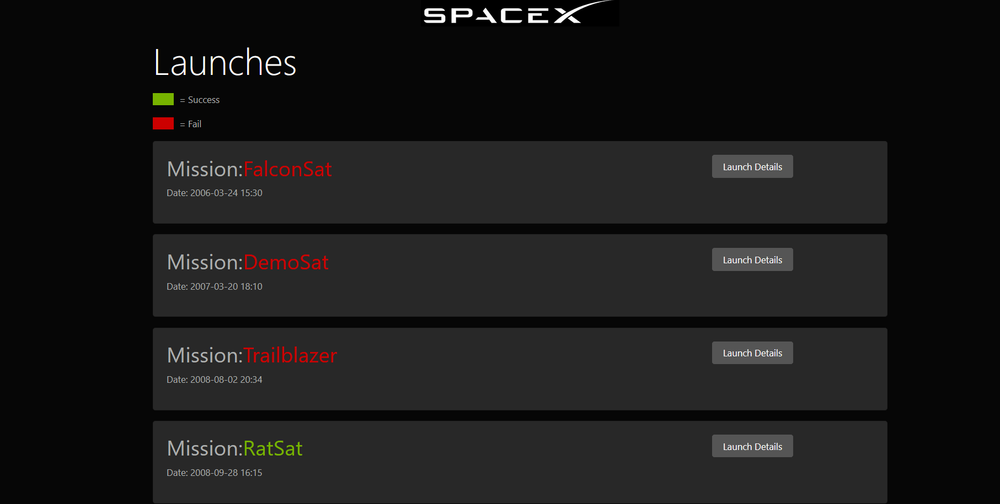
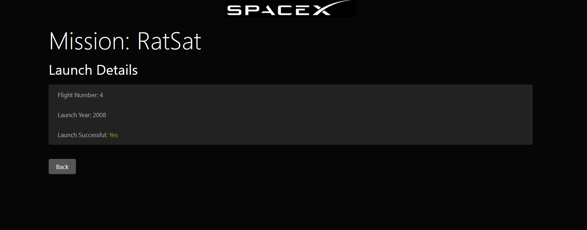
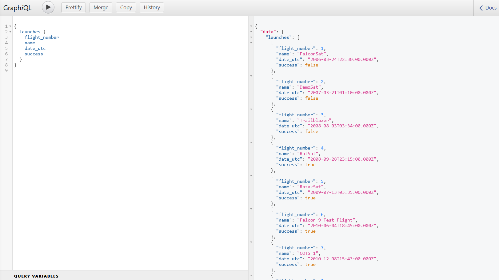

# SPACEX_LAUNCH_STATS
 SpaceX launch Stat app __ GraphQL

An App using GraphQL, React.js and SpaceX api, to display SpaceX Launch missions.

 
User Interface:

 

 
Data fetched in GraphQL from SpaceX API:
